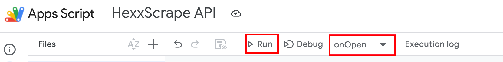
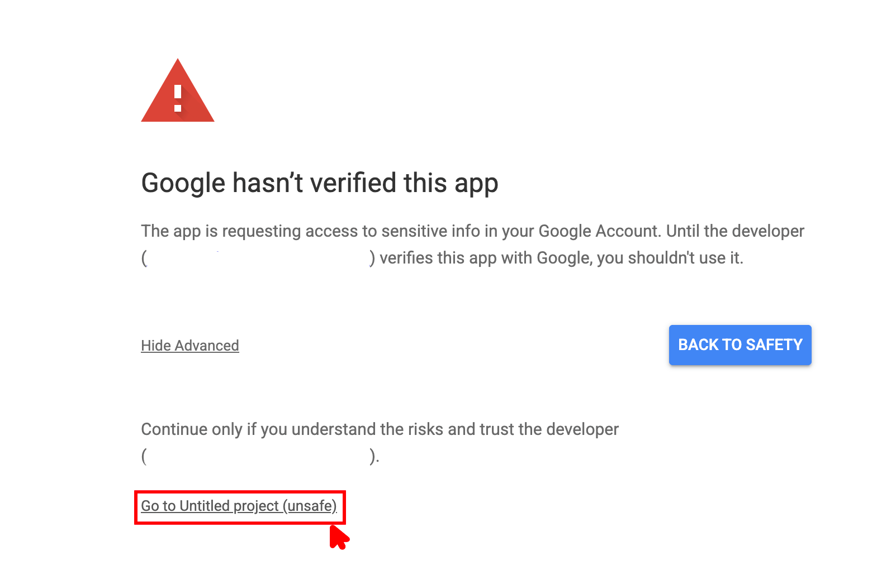
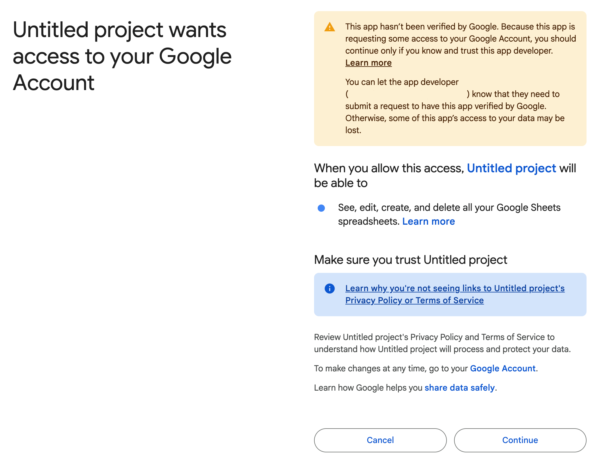
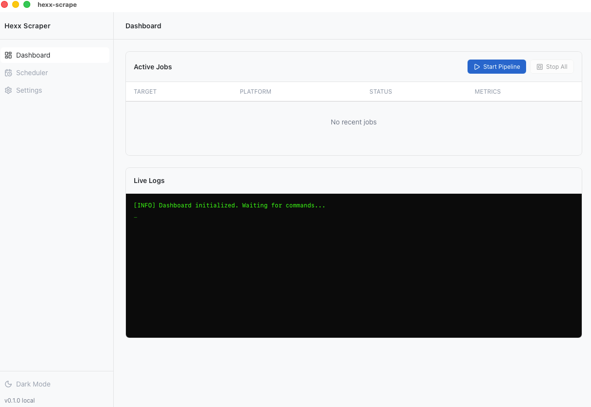

# Hexx Scraper

## <image src='./images/commonstack_logo.png' width="30" height="30" style='vertical-align: middle; margin-bottom: 5px;' />Powered by Commonstack

Hexx Scraper is optimized for **[Commonstack](https://commonstack.ai)**, Inference Marketplace for all models.

- **Unified Access**: One API key for 25+ flagship models (GPT-5, Claude 4.6, Grok 4.1).
- **Zero Latency**: Optimized routing for tool-calling agents like Hexx.
- **Cost Efficient**: Pay-as-you-go with deep discounts on OSS-scale models.

## 📥 Download (Recommended)

**For most users: No Python or Node.js required.**

If you just want to use the app, download the latest standalone installer for your operating system from the **[Releases](../../releases)** page:
- **Windows**: Download the `.msi` installer.
- **macOS**: Download the `.dmg` file.

Simple install and run—the app is fully self-contained and includes the built-in AI engine.

---

## 📊 Google Sheets Setup Guide

To use Hexx Scraper, you need to connect it to a Google Sheet. Follow these steps:

### 1. Initialize the Script
1. Create a new Google Sheet.
2. Go to **Extensions > Apps Script**.
3. Copy the contents of `src/code.gs` from this project and paste it into the script editor.
4. In the toolbar, choose **onOpen** from the functions dropdown and click **Run**.

### 2. Authorization (First Time Only)
When you run the script for the first time, Google will require authorization:
1. Click **Review Permissions**.
2. Select your Google Account.
3. Click **Advanced** and then **Go to [Project Name] (unsafe)**.

4. Click **Continue**.

### 3. Setup Tables
1. Return to your Google Sheet. You will now see a new menu: **Hexx Scraper**.
2. Click **Hexx Scraper > Initialize Sheets** to create and style the required tabs.

### 4. Deploy the Webhook
1. In the Apps Script editor, click **Deploy > New deployment**.
2. Select type **Web app**.
3. Set "Who has access" to **Anyone**.
4. Click **Deploy** and copy the **Web app URL**.
5. Paste this URL into the **Settings** page of the Hexx Scraper desktop app.

---

## ⚙️ How It Works

### 🎨 Frontend: Modern & Minimal
- **Stack**: Built with **React 19**, **TypeScript**, and **TailwindCSS v4**.
- **Design Philosophy**: Adheres to the *Uncodixfy* standards—no "cheap" AI gradients or glassmorphism. It uses a custom **Slate Noir** (Dark) and **Pearl Minimal** (Light) palette.

### 🧠 Backend: The Rust-Python Bridge
- **Core (Rust/Tauri v2)**: The main application shell is written in **Rust**. It handles native OS tasks like secure settings persistence, multi-threaded scheduling, and managing the AI lifecycle.
- **Engine (Python Sidecar)**: The "heavy lifting" is done by a specialized Python engine bundled as a native binary.
- **Agent Logic**: Uses `browser-use` and **Playwright** to navigate X and Reddit like a human would, extracting metrics that traditional APIs often hide.
- **JSON-RPC Communication**: The Rust core and Python engine communicate via a high-speed stdin/stdout pipe, allowing real-time logs to stream directly into the app's dashboard.
- **Persistence**: Automatically reads target URLs from your **Google Sheets** and pushes results back via a custom **Apps Script Webhook**, eliminating the need for complex database setups.

---

## 🚀 Developer Setup (Build from Source)

If you want to modify the code or build it yourself, follow these steps:

### Windows
1. Double-click **`setup.bat`**. This will create your environment and install all dependencies automatically.
2. Once finished, double-click **`run.bat`** to launch the application.

### macOS / Linux
1. Open your terminal in this folder.
2. Run `./setup.sh`.
3. Once finished, run `./run.sh` to launch the application.

---

## 🔑 Prerequisites (For Developers)
If building from source, you will need:
- **Python 3.10+**
- **Node.js 20+**
- **Rust** (Stable)
